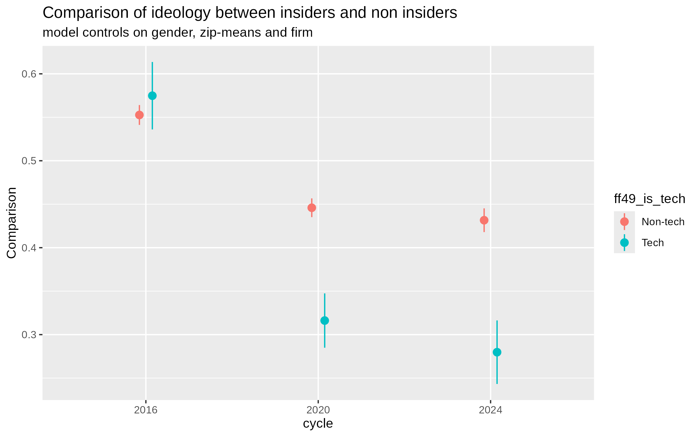
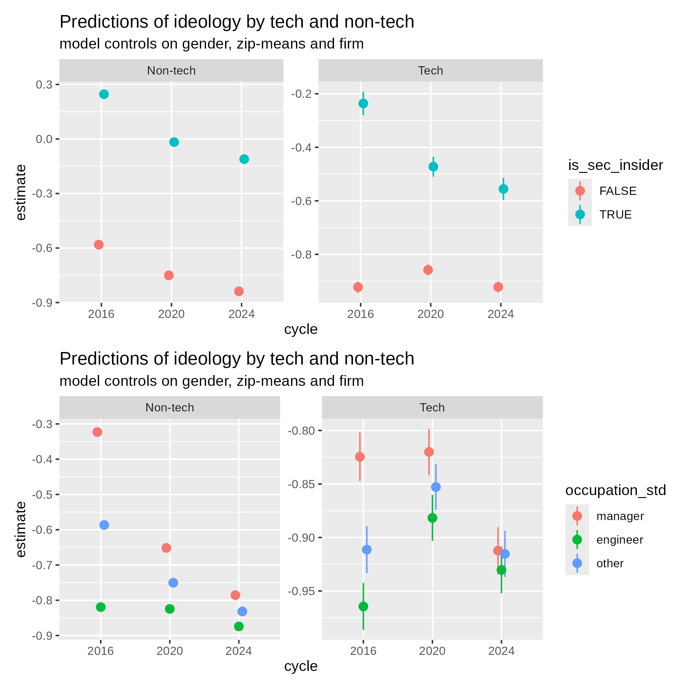

# README

This is the full repository to reproduce the analysis in my Bachelors Thesis with the title: "On the ideology of the tech industry -
Evaluating the impact of recent presidential elections on the ideological evolution of occupational groups in the American Tech sector".

While the results can already be found precomputed in the [results folder](results/), they can also be reproduced by running [main.r](main.r). [main.r](main.r) calls the scripts, as well as the helper scripts in the right order. When running V1, one has to manually count the false positives and false negatives in order to produce the table.

The R statistical programming language, as well as other packages referenced to later in this README.md were used for the analysis. The helper scripts, such as [H_SIC_lookup.R](H_SIC_lookup.R) have been mostly created with the help of Claude Sonnet/Opus 5, while the analysis steps have been only assisted by Claude a bit, especially for error handeling.

## Hypotheses:

The hypotheses tested are the following:
 
H1: Tech employees are on average more liberal than employees in other firms

H2: TMTs are more conservative than other occupation groups

H3: Tech TMTs are less conservative than other TMTs

H4: TMTs in general shifted to the left in recent years

H5: In tech firms from 2016 to 2024, TMTs kept being more conservative than other occupation groups

H6: While tech workers shifted only left from 2016 to 2024, there is a trend in tech TMTs that shifted towards the Republicans from 2020 to 2024

While TMT refer to "Top Management Teams" and tech workers to relatively well-paid engineer positions.

## Findings

While most of the hypotheses are found true, the most important one for this analysis, $H_6$ was found no evidence for. On the contrary: instead of a divergence in ideology inside of the tech industry, there could be found evidence for further convergence. While the ideological mean distance between tech insiders (managers of very high rank inside of the firms) and non-tech insiders is cut in half from 2016 to 2024, while controlling for gender, location and firm, the mean distance between others, engineers (tech workers) and managers (all managers, identified via regex) disappears completely.

Further implications of this finding are being discussed in the thesis.

## Additional notes

Gender was sadly not computed correctly compute in the original computation of the dataset used as a basis for the thesis. Contributors that had a blank space "" as gender were not assigned either a specific group deliberately, nor filtered out. Luckily, it isn't that big of a problem, since there were not enough data points in insiders, so they were filtered out for the important models which test H5 and H6 anyways. To filter them out in the reproduction, you may comment the according code lines in.

## References to the packages used

I used R v. 4.6.1 (R Core Team 2026a) and the following R packages: archive v. 1.1.13 (Hester and Csárdi 2026), arrow v. 24.0.0 (Richardson et al. 2026), callr v. 3.8.0 (Csárdi and Chang 2026), curl v. 7.1.0 (Ooms 2026), dagitty v. 0.3.4 (Textor et al. 2016), DBI v. 1.3.0 (R Special Interest Group on Databases (R-SIG-DB) et al. 2026), duckdb v. 1.5.2 (Mühleisen and Raasveldt 2026), ggdag v. 0.2.13 (Barrett 2024), glue v. 1.8.1 (Hester and Bryan 2026), here v. 1.0.2 (Müller 2025), httr2 v. 1.2.3 (Wickham 2026), lme4 v. 2.0.1 (Bates et al. 2015), marginaleffects v. 0.32.0 (Arel-Bundock et al. 2024), modelsummary v. 2.6.0 (Arel-Bundock 2022), parallel v. 4.6.1 (R Core Team 2026b), patchwork v. 1.3.2 (Pedersen 2025), renv v. 1.2.3 (Ushey and Wickham 2026), sjPlot v. 2.9.0 (Lüdecke 2025), stargazer v. 5.2.3 (Hlavac 2022), stringdist v. 0.9.17 (van der Loo 2014), tictoc v. 1.2.1 (Izrailev 2024), tidyverse v. 2.0.0 (Wickham et al. 2019), tinytable v. 0.18.0 (Arel-Bundock 2026), tools v. 4.6.1 (R Core Team 2026c), xtable v. 1.8.8 (Dahl et al. 2026).